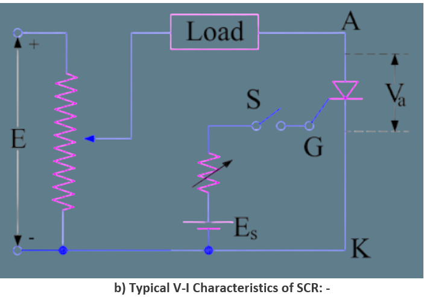
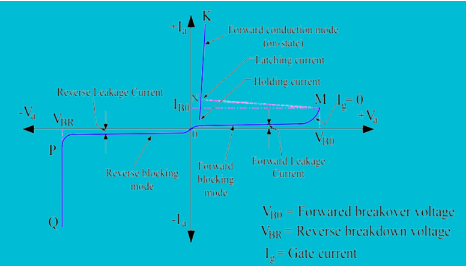

<h3>a) Definition of V-I Characteristics of SCR: -</h3>
The V-I Characteristics of an SCR (Silicon Controlled Rectifier) represent the relationship between the voltage applied across its anode and cathode and the resulting current flowing through it, for different gate currents as shown in Fig.1. These characteristics are important because they illustrate the switching behavior of the SCR—how it moves from the forward blocking state (off-state) to the forward conduction state (on-state).

The curve helps us understand: 
1.The forward blocking region (SCR behaves like an open switch). 
2.The latching and holding currents required to keep it conducting. 
3.The forward conduction region (SCR behaves like a closed switch). 
4.The reverse blocking region (like a diode in reverse bias).

  Fig. 1: Structure of an SCR  

  

<h3>b) Circuit Diagram for Obtaining V-I Characteristics of SCR: -</h3>
To obtain the V-I characteristics of an SCR, its anode (A) and cathode (K) are connected to a variable voltage source E through the load. The gate (G) and cathode (K) are supplied by a separate source Es, which provides a positive gate current from G to K. The elementary circuit diagram for obtaining the V-I characteristics of an SCR is shown in Fig. 2.

In Fig. 2, the anode and cathode terminals (A & K) are connected to the variable voltage source E through the load, while the gate terminal (G) is connected to the source Es to provide a positive gate current through G to K when the switch S is closed. Va and Ia represent the voltage across the anode–cathode terminals and the current through the SCR, respectively. A plot between Va and Ia is obtained by varying the source voltage E and recording the corresponding current through the SCR, as shown in Fig. 3   Fig.2: This plot gives the V-I characteristics of SCR. 

  
                                                                                                     
 Fig.3: A typical V-I Characteristics of SCR is shown below :- 

