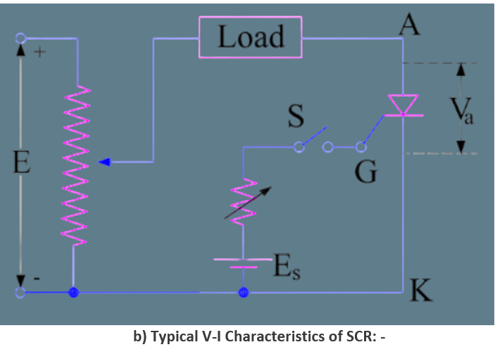
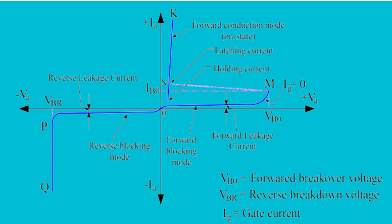

<h3>a) Definition of V-I Characteristics of SCR: -</h3>
A V-I Characteristic of SCR (Silicon Controlled Rectifier) is the voltage current characteristics. The current through the SCR varies as the Anode to Cathode terminal voltage and Gate to Cathode terminal voltage is varied. The graphical representation of current through the SCR and voltage across the anode to cathode terminal is known as V-I Characteristics of SCR.
<h3>b) Circuit Diagram for Obtaining V-I Characteristics of SCR: -</h3>
To obtain V-I characteristics of SCR, its anode and cathode are connected to the source through the load.  The Gate and cathode are fed through a separate source  which is meant to provide positive gate current from gate to cathode. The elementary circuit diagram for obtaining V-I characteristics of SCR is shown below. 
In the above diagram, Anode and Cathode terminals A & K are connected to variable voltage source E through Load and Gate terminal G is connected to the source Es to provide positive gate current through G to K when switch S is closed. Va and Ia represent the voltage across the anode to cathode terminals and current through the SCR. A plot between Va and Ia is drawn by varying the source voltage E and noting the corresponding current through SCR.   This plot gives the V-I characteristics of SCR. 

  
                                                                                                     
A typical V-I Characteristics of SCR is shown below 

